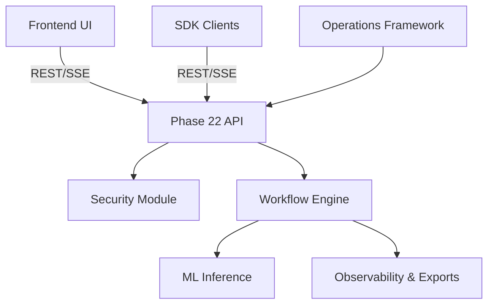
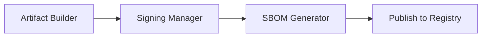

# Architecture Overview

CrowdDNA follows a decoupled, feature-based microservices and modular monolith design.

## System Topology

## Frontend/Backend Interaction
The frontend is a fully isolated Vite/React application that communicates exclusively via the API layer. No shared memory or database connections exist between the UI and backend.

## Release Pipeline

## Key Architectural Principles
- **Separation of Concerns**: Deployment, Release, Frontend, and ML Inference are strictly isolated.
- **Stateless API**: The API tier maintains no session state.
- **Event-Driven**: Internal subsystems communicate via domain events.
