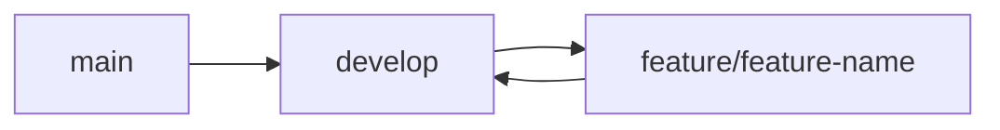

# Branching Strategy

Our strategy is based on strict PR-driven development.

## Rules
- **Never commit directly to `main`.**
- **Never commit directly to `develop`.**
- Everything must go through a Pull Request.
- Feature branches should be deleted after merging.
