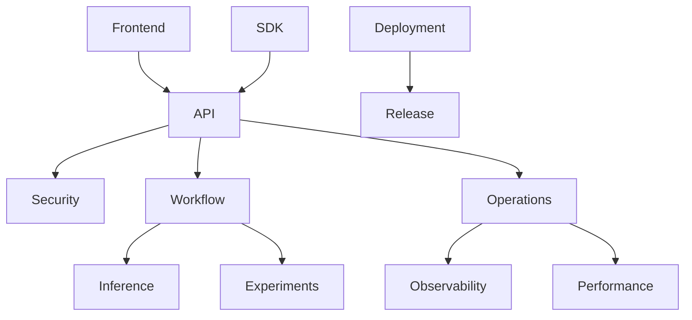

# Subsystem Dependency Graph

```mermaid
graph TD
  API --> Security
  API --> Workflow
  API --> Operations
  Workflow --> Inference
  Workflow --> Experiments
  Operations --> Observability
  Operations --> Performance
  Deployment --> Release
  Frontend --> API
  SDK --> API
```

This graph ensures no circular dependencies exist. Operations never depends on Frontend, and Security is a foundational layer consumed by the API.
