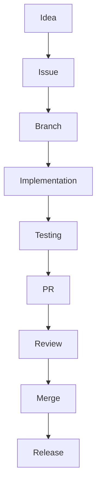

# Engineering Workflow

Our development process follows a strict flow to ensure quality and architectural consistency.

## Workflow

1. **Idea**: Discussed async or in sync.
2. **Issue**: Created on GitHub with proper labels.
3. **Branch**: Branched from `develop` following `feature/<name>`.
4. **Implementation**: Code following coding standards.
5. **Testing**: Unit tests and smoke tests added.
6. **PR**: Pull Request opened against `develop`.
7. **Review**: Reviewed by the appropriate domain owner.
8. **Merge**: Squashed and merged into `develop`.
9. **Release**: Managed by the Technical Lead.
