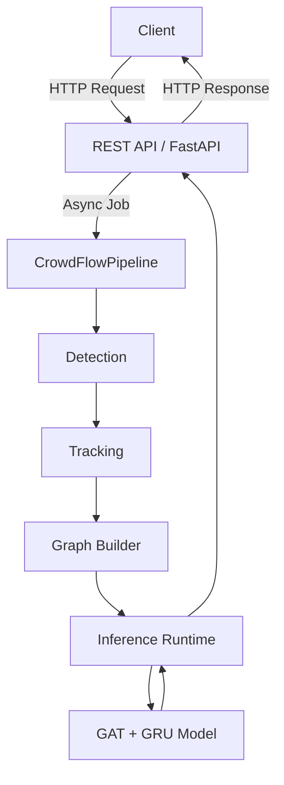

# CrowdDNA API Specification

## Executive Summary
This document serves as the official API contract for CrowdDNA. It maps the existing headless machine learning orchestration engine (`CrowdFlowPipeline`, `InferenceRuntime`) to a set of robust REST endpoints.

## Repository Mapping Summary

| Existing Repository Component | Future API Endpoint |
|-------------------------------|---------------------|
| `CrowdFlowPipeline.run(video)` | `POST /inference` |
| `InferenceRuntime.load_model()` | `POST /models/load` |
| `DeploymentManager.health` | `GET /health`, `GET /health/live`, `GET /health/ready` |
| Application Version | `GET /version` |
| System Metrics | `GET /metrics` |

## Architecture

