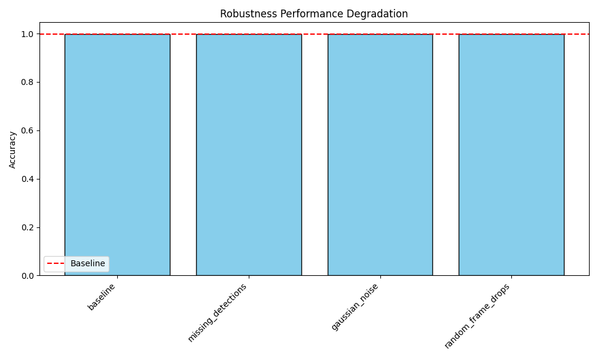
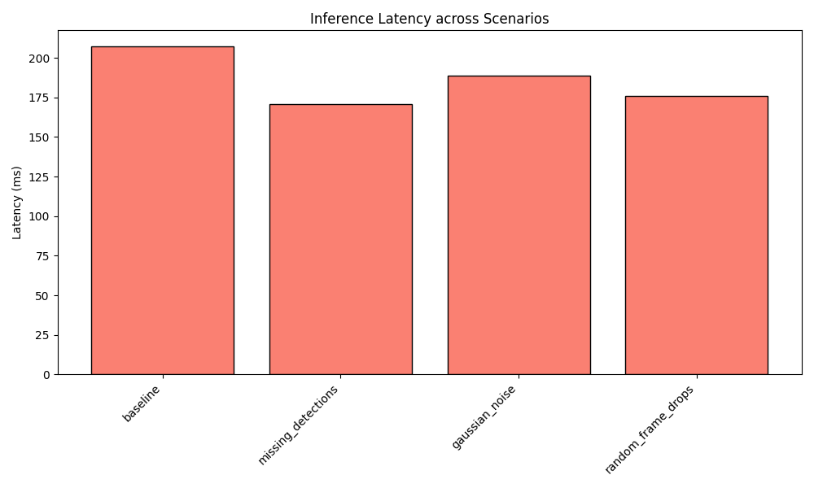

# Robustness Evaluation Report

## Configuration
- **Model**: `experiments\runs\baseline_20260722_230537\deploy\deployment.pt`
- **Seed**: `42`

## Results

| Scenario | Accuracy | Average Latency (ms) | Mean Confidence |
| --- | --- | --- | --- |
| baseline | 0.9967 | 206.9636 | 0.9941 |
| missing_detections | 0.9967 | 170.5716 | 0.9938 |
| gaussian_noise | 0.9967 | 188.6599 | 0.9941 |
| random_frame_drops | 0.9967 | 175.6985 | 0.9842 |

## Plots

