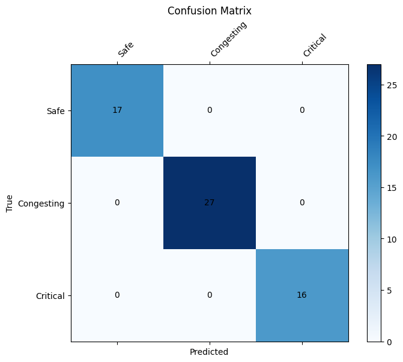
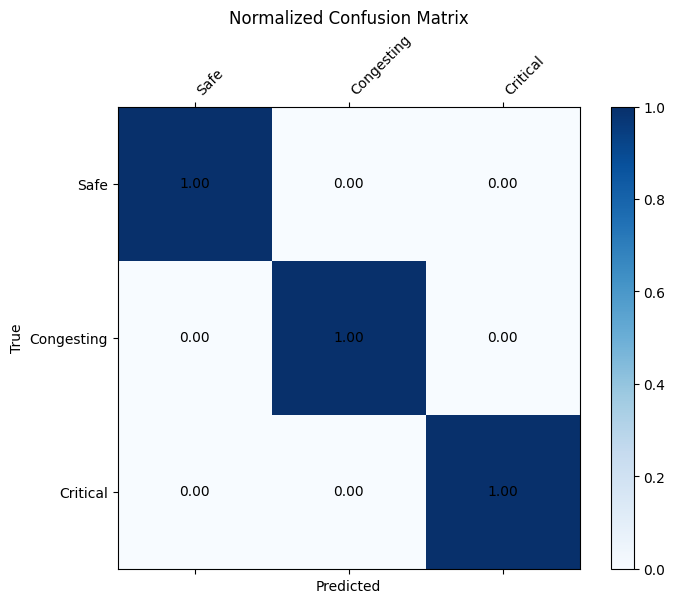
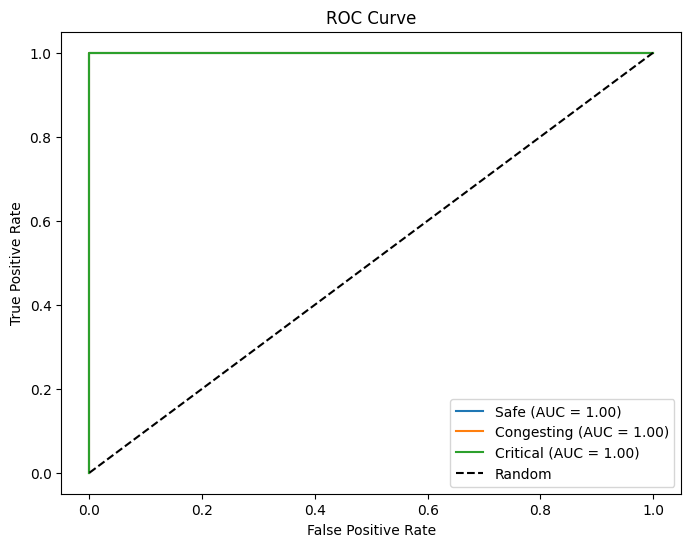
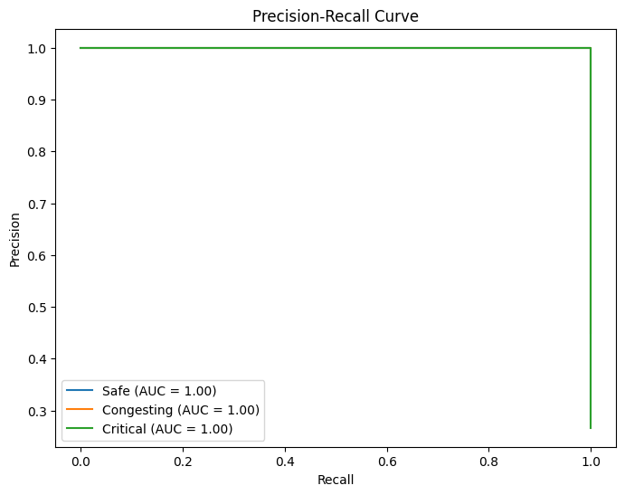

# Evaluation Report

## Experiment Metadata
- **Timestamp**: 2026-07-22T17:35:37.590284+00:00
- **Git Commit**: 6fdc5b0558c9bd9fe4483be0cb7d63b4d764d531
- **Total Training Time**: 1662.621191100001
- **Evaluation Time**: 13.442767800001093
- **Best Checkpoint**: C:\Users\piyus\Downloads\CrowdDNA\experiments\runs\baseline_20260722_230537\checkpoints\best.pt

## Model Configuration
```yaml
{
  "simulation": {
    "output_dir": "data/simulated"
  },
  "model": {
    "gnn_hidden_dim": 128,
    "gru_hidden_dim": 64,
    "gru_num_layers": 2,
    "gru_dropout": 0.1,
    "gru_bidirectional": true,
    "num_gnn_layers": 2,
    "classes": [
      "Safe",
      "Congesting",
      "Critical"
    ]
  },
  "training": {
    "batch_size": 16,
    "num_epochs": 50,
    "learning_rate": 0.001,
    "validation_split": 0.2,
    "checkpoint_dir": "C:\\Users\\piyus\\Downloads\\CrowdDNA\\experiments\\runs\\baseline_20260722_230537\\checkpoints",
    "random_seed": 42,
    "deterministic": true
  }
}
```

## Global Metrics
- **Accuracy**: 1.0000
- **Macro Precision**: 1.0000
- **Macro Recall**: 1.0000
- **Macro F1**: 1.0000

## Metrics Table
[Download CSV](metrics.csv)

## Visualizations
### Confusion Matrix


### Normalized Confusion Matrix


### ROC Curve


### Precision-Recall Curve

